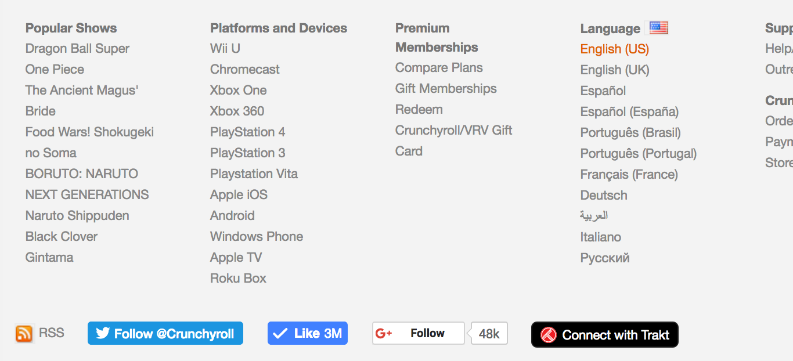
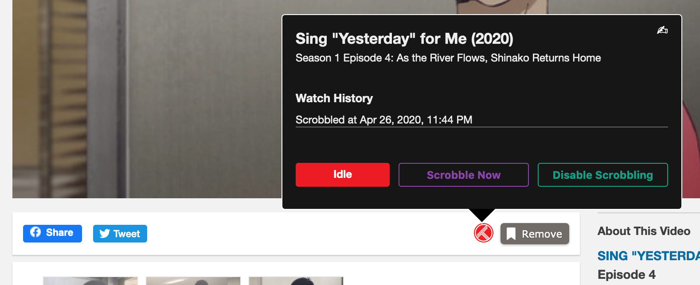

# TraktRoller

TraktRoller is a User Script that adds [Trakt](trakt.tv) scrobbling to Crunchyroll and Funimation.

## Features

* Scrobble movies and episodes watched on Crunchyroll or Funimation
* Scrobble immediately
* Turn scrobbling on or off
* View Trakt watch history and remove entries

# Install

TraktRoller is a Userscript and can only be used together with a Userscript extension.

TraktRoller has been tested with [Violentmonkey](https://violentmonkey.github.io) on the latest Chrome and Firefox versions.

Either go to [TraktRoller on OpenUserJS](https://openuserjs.org/scripts/sttz/TraktRoller) and click on Install or open the [script file](./dist/TraktRoller.user.js?raw=true) directly from GitHub.

# Introduction

Click on the «Connect with Trakt» button in the footer and allow the app to access your Trakt account.

Play any video and a Trakt button will appear next to the queue button. Hover on the button to open the popup.

At the top of the popup you'll see the Trakt episode or movie that has been matched.

If the video has been scrobbled before, the history will be displayed. Hovering over a history item will show a button to remove that item.

The buttons at the bottom:
- Red: Shows the current scrobbling state
- Purple: Immediately add the video to the watch history
- Green: Disable scrobbling permanently until it's reenabled again

If the episode can't be found or it's incorrect, the match can be changed using the "✍︎" button by entering the correct Trakt URL. Supported are:
- https://trakt.tv/movies/name
- https://trakt.tv/shows/name
- https://trakt.tv/shows/name/seasons/x/episodes/x

If only the URL is of a show and not a specific episode, TraktRoller will try to find the episode in the given show.

# Changelog

### 1.1.0 (2020-04-27)

- Add support for Funimation
- Manually correct mismatched or failed matches by providing the item's Trakt URL
- Moved UI into shadow DOM to better isolate them from the website

### 1.0.6 (2019-12-26)

- Fix special characters interfering with title search

### 1.0.5 (2019-05-06)

- Handle fractional episode numbers (only supports lookup by title)
- Fix episode lookup by title

### 1.0.4 (2019-02-17)

- Use new automatic episode lookup with `number_abs` when lookup with `number` failed

### 1.0.3 (2019-01-22)

- Improve message in popup when episode couldn't be found or error occurred
- Fix manual lookup by absolute episode number only searches the current season

### 1.0.2 (2019-01-15)

- Lower minimum score for search results
- Fix continuing with next search result despite last one being a success
- More conservative movie classification (fixes some episodes being misdetected as movies)

### 1.0.1 (2018-12-19)

- Fix scrobbling of shows without episode title
- Fix trying to scrobble even when not connected

### 1.0.0 (2018-11-27)

- Initial release
